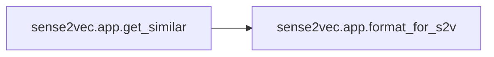
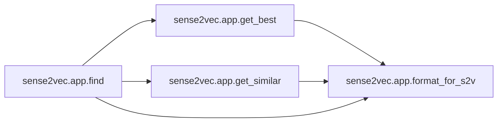
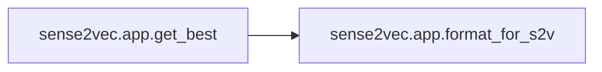

# Key Objects

[_Documentation generated by Documatic_](https://www.documatic.com)

<!---Documatic-section-sense2vec.app.format_for_s2v-start--->
## sense2vec.app.format_for_s2v

<!---Documatic-section-format_for_s2v-start--->
<!---Documatic-block-sense2vec.app.format_for_s2v-start--->
<details>
	<summary><code>sense2vec.app.format_for_s2v</code> code snippet</summary>

```python
def format_for_s2v(word, sense):
    return word.replace(' ', '_') + '|' + sense
```
</details>
<!---Documatic-block-sense2vec.app.format_for_s2v-end--->
<!---Documatic-section-format_for_s2v-end--->

# #
<!---Documatic-section-sense2vec.app.format_for_s2v-end--->

<!---Documatic-section-sense2vec.app.get_similar-start--->
## sense2vec.app.get_similar

<!---Documatic-section-get_similar-start--->


### Object Calls

* sense2vec.app.format_for_s2v

<!---Documatic-block-sense2vec.app.get_similar-start--->
<details>
	<summary><code>sense2vec.app.get_similar</code> code snippet</summary>

```python
def get_similar(word, sense, n=100):
    query = format_for_s2v(word, sense)
    if query not in S2V:
        return []
    (freq, query_vector) = S2V[query]
    (words, scores) = S2V.most_similar(query_vector, n)
    words = [word.rsplit('|', 1) for word in words]
    words = [entry for entry in words if len(entry) == 2]
    words = [(word.replace('_', ' '), sense) for (word, sense) in words]
    return zip(words, scores)
```
</details>
<!---Documatic-block-sense2vec.app.get_similar-end--->
<!---Documatic-section-get_similar-end--->

# #
<!---Documatic-section-sense2vec.app.get_similar-end--->

<!---Documatic-section-sense2vec.app.find-start--->
## sense2vec.app.find

<!---Documatic-section-find-start--->


### Object Calls

* sense2vec.app.get_best
* sense2vec.app.get_similar
* sense2vec.app.format_for_s2v

<!---Documatic-block-sense2vec.app.find-start--->
<details>
	<summary><code>sense2vec.app.find</code> code snippet</summary>

```python
@hug.post('/find')
def find(word: str, sense: str='auto', n_results: int=200):
    (best_word, best_sense) = get_best(word, sense)
    if not word or not best_word:
        return {'text': word, 'sense': sense, 'results': [], 'count': 0}
    results = []
    seen = set([best_word, min(LEMMATIZER(best_word, best_sense))])
    similar = get_similar(best_word, best_sense, n_results)
    for ((word_entry, sense_entry), score) in similar:
        head = min(LEMMATIZER(word_entry, sense_entry))
        if head not in seen:
            (freq, _) = S2V[format_for_s2v(word_entry, sense_entry)]
            results.append({'score': score, 'text': word_entry, 'count': freq})
            seen.add(head)
        if len(results) >= n_results:
            break
    return {'text': best_word, 'sense': best_sense, 'results': results}
```
</details>
<!---Documatic-block-sense2vec.app.find-end--->
<!---Documatic-section-find-end--->

# #
<!---Documatic-section-sense2vec.app.find-end--->

<!---Documatic-section-sense2vec.app.get_best-start--->
## sense2vec.app.get_best

<!---Documatic-section-get_best-start--->


### Object Calls

* sense2vec.app.format_for_s2v

<!---Documatic-block-sense2vec.app.get_best-start--->
<details>
	<summary><code>sense2vec.app.get_best</code> code snippet</summary>

```python
def get_best(word, sense):
    if sense != 'auto':
        if format_for_s2v(word, sense) in S2V:
            return (word, sense)
        return (None, None)
    freqs = []
    casings = [word, word.upper(), word.title()] if word.islower() else [word]
    for text in casings:
        for tag in SENSES:
            query = format_for_s2v(text, tag)
            if query in S2V:
                freqs.append((S2V[query][0], (text, tag)))
    return max(freqs)[1] if freqs else (None, None)
```
</details>
<!---Documatic-block-sense2vec.app.get_best-end--->
<!---Documatic-section-get_best-end--->

# #
<!---Documatic-section-sense2vec.app.get_best-end--->

<!---Documatic-section-sense2vec.app.senses-start--->
## sense2vec.app.senses

<!---Documatic-section-senses-start--->
<!---Documatic-block-sense2vec.app.senses-start--->
<details>
	<summary><code>sense2vec.app.senses</code> code snippet</summary>

```python
@hug.get('/senses')
def senses():
    return SENSES
```
</details>
<!---Documatic-block-sense2vec.app.senses-end--->
<!---Documatic-section-senses-end--->

# #
<!---Documatic-section-sense2vec.app.senses-end--->

[_Documentation generated by Documatic_](https://www.documatic.com)